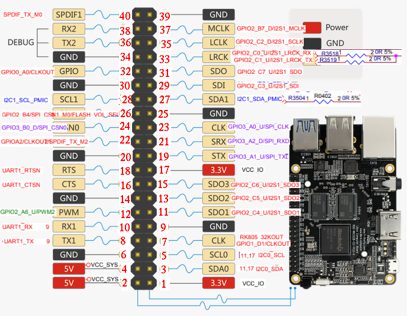

# OctoLight
A simple plugin that adds a button to the navigation bar for toggleing a GPIO pin on the ROC-RK3328-CC (Renegade).

## Setup
Install via the bundled [Plugin Manager](https://docs.octoprint.org/en/master/bundledplugins/pluginmanager.html)
or manually using this URL:

	https://github.com/gigibu5/OctoLight/archive/master.zip

## Configuration

Curently, you can configure two settings:
- `Light PIN`: The pin on the ROC-RK3328-CC (Renegade) that the button controls.
	- Default value: 12
	- The pin number is saved in the **board layout naming** scheme (Red labels on the pinout image below).
	- **!! IMPORTANT !!** The ROC-RK3328-CC (Renegade) can only control the **GPIO** pins (Tan labels on the pinout image below)
	
        
- `Inverted output`: If true, the output will be inverted
	- Usage: if you have a light, that is turned off when voltage is applied to the pin (wired in negative logic), you should turn on this option, so the light isn't on when you reboot your Raspberry Pi.

## API
Base API URL : `GET http://YOUR_OCTOPRINT_SERVER/api/plugin/octolight?action=ACTION_NAME`

This API always returns updated light state in JSON: `{state: true}`

_(if the action parameter not given, the action toggle will be used by default)_
#### Actions
- **toggle** (default action): Toggle light switch on/off.
- **turnOn**: Turn on light.
- **turnOff**: Turn off light.
- **getState**: Get current light switch state.

## TO DO
- [x] Update interface if Light is turned on or off

Maybe in the distant future:
- [ ] Turn off on finish print
